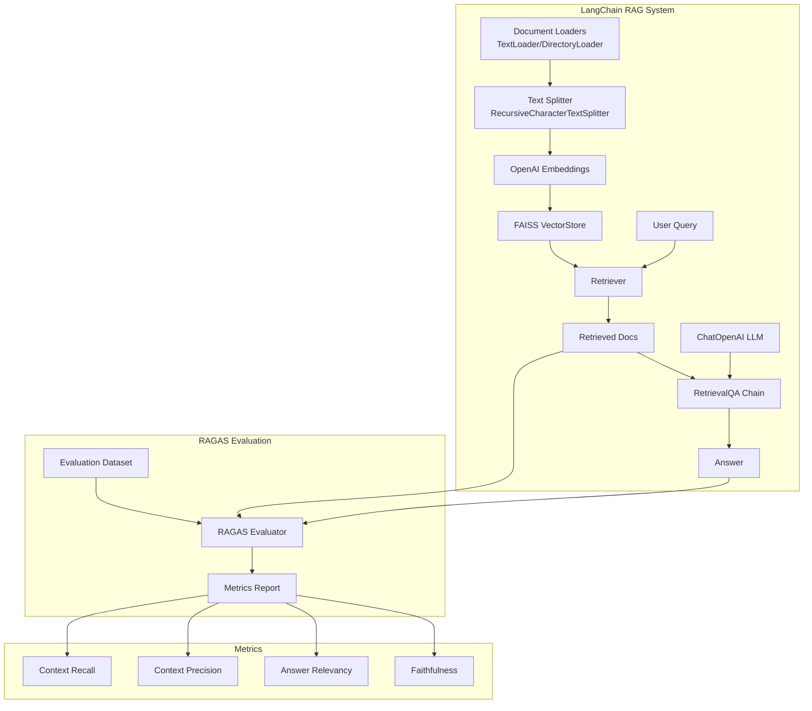

# Design Document: RAGAS Evaluation Demo

## Overview

本项目实现一个完整的 RAGAS 评测演示系统，基于 **LangChain** 框架构建，包含两个核心部分：

1. **本地 RAG 系统**：使用 LangChain 构建的检索增强生成系统，使用 FAISS 本地向量存储，调用 OpenAI API
2. **RAGAS 评测框架**：集成 RAGAS 库对 RAG 系统进行多维度评测

技术选型：
- **框架**: LangChain（简化 RAG 流程构建）
- **向量化**: OpenAI Embeddings（通过 LangChain）
- **向量存储**: FAISS（LangChain 集成）
- **大模型**: OpenAI GPT（通过 LangChain）
- **评测**: ragas 库

## Architecture



### 数据流

1. **索引阶段**：文档 → LangChain TextSplitter 分块 → OpenAI Embeddings 向量化 → FAISS 存储
2. **查询阶段**：查询 → FAISS Retriever 检索 → RetrievalQA Chain → ChatOpenAI 生成回答
3. **评测阶段**：评测数据集 → RAG 系统处理 → RAGAS 计算指标 → 输出报告

## Components and Interfaces

### 1. DocumentProcessor（基于 LangChain）

```python
from langchain_community.document_loaders import TextLoader, DirectoryLoader
from langchain.text_splitter import RecursiveCharacterTextSplitter

class DocumentProcessor:
    """文档处理器，封装 LangChain 文档加载和分块功能"""
    
    def __init__(self, chunk_size: int = 500, chunk_overlap: int = 50):
        """
        初始化文档处理器
        
        Args:
            chunk_size: 每个块的最大字符数
            chunk_overlap: 块之间的重叠字符数
        """
        self.text_splitter = RecursiveCharacterTextSplitter(
            chunk_size=chunk_size,
            chunk_overlap=chunk_overlap
        )
    
    def load_file(self, file_path: str) -> list[Document]:
        """
        加载单个文档并分块
        
        Args:
            file_path: 文档路径
            
        Returns:
            LangChain Document 对象列表
        """
        pass
    
    def load_directory(self, dir_path: str, glob: str = "**/*.txt") -> list[Document]:
        """
        加载目录下所有文档并分块
        
        Args:
            dir_path: 目录路径
            glob: 文件匹配模式
            
        Returns:
            LangChain Document 对象列表
        """
        pass
```

### 2. VectorStoreManager（基于 LangChain FAISS）

```python
from langchain_community.vectorstores import FAISS
from langchain_openai import OpenAIEmbeddings

class VectorStoreManager:
    """向量存储管理器，封装 LangChain FAISS 操作"""
    
    def __init__(self, api_key: str):
        """
        初始化向量存储管理器
        
        Args:
            api_key: OpenAI API 密钥
        """
        self.embeddings = OpenAIEmbeddings(api_key=api_key)
        self.vector_store: FAISS = None
    
    def create_from_documents(self, documents: list[Document]) -> FAISS:
        """
        从文档创建向量存储
        
        Args:
            documents: LangChain Document 列表
            
        Returns:
            FAISS 向量存储实例
        """
        pass
    
    def add_documents(self, documents: list[Document]) -> None:
        """增量添加文档到向量存储"""
        pass
    
    def similarity_search(self, query: str, k: int = 4) -> list[Document]:
        """
        相似度搜索
        
        Args:
            query: 查询文本
            k: 返回结果数量
            
        Returns:
            相关文档列表
        """
        pass
    
    def save(self, path: str) -> None:
        """保存向量存储到本地"""
        pass
    
    def load(self, path: str) -> None:
        """从本地加载向量存储"""
        pass
    
    def as_retriever(self, k: int = 4) -> VectorStoreRetriever:
        """获取 LangChain Retriever 接口"""
        pass
```

### 3. RAGChain（基于 LangChain RetrievalQA）

```python
from langchain.chains import RetrievalQA
from langchain_openai import ChatOpenAI

class RAGChain:
    """RAG 链，封装 LangChain RetrievalQA"""
    
    def __init__(
        self,
        vector_store_manager: VectorStoreManager,
        api_key: str,
        model: str = "gpt-3.5-turbo",
        k: int = 4
    ):
        """
        初始化 RAG 链
        
        Args:
            vector_store_manager: 向量存储管理器
            api_key: OpenAI API 密钥
            model: 模型名称
            k: 检索文档数量
        """
        self.llm = ChatOpenAI(api_key=api_key, model=model)
        self.retriever = vector_store_manager.as_retriever(k=k)
        self.chain = RetrievalQA.from_chain_type(
            llm=self.llm,
            chain_type="stuff",
            retriever=self.retriever,
            return_source_documents=True
        )
    
    def query(self, question: str) -> RAGResponse:
        """
        查询并生成回答
        
        Args:
            question: 用户问题
            
        Returns:
            RAGResponse 包含答案和上下文
        """
        pass
```

### 4. RagasEvaluator

```python
from ragas import evaluate
from ragas.metrics import faithfulness, answer_relevancy, context_precision, context_recall
from datasets import Dataset

class RagasEvaluator:
    """RAGAS 评测器"""
    
    def __init__(self, rag_chain: RAGChain):
        """
        初始化评测器
        
        Args:
            rag_chain: RAG 链实例
        """
        self.rag_chain = rag_chain
        self.metrics = [
            faithfulness,
            answer_relevancy,
            context_precision,
            context_recall
        ]
    
    def load_dataset(self, path: str) -> list[EvaluationSample]:
        """
        加载评测数据集
        
        Args:
            path: 数据集文件路径 (JSON 格式)
            
        Returns:
            评测样本列表
        """
        pass
    
    def prepare_evaluation_data(self, samples: list[EvaluationSample]) -> Dataset:
        """
        准备 RAGAS 评测数据
        
        对每个样本调用 RAG 链获取答案和上下文，
        构建 RAGAS 所需的 Dataset 格式
        
        Args:
            samples: 评测样本列表
            
        Returns:
            HuggingFace Dataset 对象
        """
        pass
    
    def evaluate(self, dataset: Dataset) -> EvaluationResult:
        """
        执行 RAGAS 评测
        
        Args:
            dataset: 准备好的评测数据集
            
        Returns:
            EvaluationResult 包含各项指标分数
        """
        pass
    
    def generate_report(self, result: EvaluationResult) -> str:
        """生成评测报告"""
        pass
```

## Data Models

```python
from dataclasses import dataclass
from typing import Optional

@dataclass
class RAGResponse:
    """RAG 响应数据模型"""
    question: str
    answer: str
    contexts: list[str]  # 检索到的上下文文本列表
    source_documents: list  # LangChain Document 对象

@dataclass
class EvaluationSample:
    """评测样本数据模型"""
    question: str
    ground_truth: str  # 参考答案
    contexts: Optional[list[str]] = None  # 可选的参考上下文

@dataclass
class EvaluationResult:
    """评测结果数据模型"""
    faithfulness: float
    answer_relevancy: float
    context_precision: float
    context_recall: float
    details: dict  # 每个样本的详细分数
```

### 评测数据集 JSON 格式

```json
{
  "samples": [
    {
      "question": "什么是 RAG？",
      "ground_truth": "RAG（Retrieval-Augmented Generation）是一种结合检索和生成的技术...",
      "contexts": ["RAG 是检索增强生成的缩写..."]
    }
  ]
}
```

## Project Structure

```
ragas-evaluation-demo/
├── src/
│   ├── __init__.py
│   ├── document_processor.py  # 文档处理器（LangChain）
│   ├── vector_store.py        # 向量存储管理器（FAISS）
│   ├── rag_chain.py           # RAG 链（RetrievalQA）
│   └── evaluator.py           # RAGAS 评测器
├── data/
│   ├── documents/             # 示例文档
│   │   └── sample.md
│   └── evaluation/            # 评测数据
│       └── test_dataset.json
├── config/
│   └── config.example.yaml    # 配置示例
├── main.py                    # 演示入口
├── requirements.txt           # 依赖列表
└── README.md                  # 项目说明
```

## Correctness Properties

*A property is a characteristic or behavior that should hold true across all valid executions of a system—essentially, a formal statement about what the system should do. Properties serve as the bridge between human-readable specifications and machine-verifiable correctness guarantees.*

### Property 1: Document Load Round-Trip

*For any* valid text content written to a TXT or Markdown file, loading the file with DocumentProcessor should return Document objects containing the original text content.

**Validates: Requirements 1.1, 1.2**

### Property 2: Text Chunk Size Constraint

*For any* text and chunk_size configuration, each chunk produced by DocumentProcessor should have length less than or equal to chunk_size (allowing for word boundary adjustments).

**Validates: Requirements 1.4**

### Property 3: Text Chunk Overlap Preservation

*For any* text with length greater than chunk_size and chunk_overlap > 0, adjacent chunks produced by DocumentProcessor should share approximately chunk_overlap characters at their boundaries.

**Validates: Requirements 1.5**

### Property 4: Vector Store Round-Trip

*For any* set of documents added to VectorStoreManager, saving to file and loading from file should preserve the ability to retrieve the same documents with identical similarity scores.

**Validates: Requirements 2.2, 2.5**

### Property 5: Incremental Document Addition

*For any* sequence of add_documents operations with N and M documents respectively, the total number of documents in VectorStoreManager should equal N + M.

**Validates: Requirements 2.3**

### Property 6: Top-K Retrieval Constraint

*For any* query and parameter K, the VectorStoreManager.similarity_search should return exactly min(K, total_documents) results.

**Validates: Requirements 3.2, 3.3**

### Property 7: Search Result Content Validity

*For any* search result returned by VectorStoreManager, it should be a valid LangChain Document with non-empty page_content.

**Validates: Requirements 3.4**

### Property 8: RAG Response Context Inclusion

*For any* RAGChain query, the returned RAGResponse should contain contexts that match the source_documents content.

**Validates: Requirements 4.1**

### Property 9: Evaluation Dataset Load Consistency

*For any* valid evaluation dataset JSON file with N samples, loading with RagasEvaluator should produce exactly N EvaluationSample objects.

**Validates: Requirements 5.1**

### Property 10: RAGAS Metrics Range Constraint

*For any* evaluation result, all metrics (faithfulness, answer_relevancy, context_precision, context_recall) should be in the range [0.0, 1.0].

**Validates: Requirements 5.2, 5.3, 5.4, 5.5**

### Property 11: Evaluation Report Completeness

*For any* EvaluationResult, the generated report should contain all four metric names and their corresponding values.

**Validates: Requirements 5.6**

### Property 12: Invalid Path Error Handling

*For any* non-existent file path, DocumentProcessor should raise FileNotFoundError with a descriptive message.

**Validates: Requirements 1.3**

### Property 13: Invalid Dataset Format Error Handling

*For any* JSON file that does not conform to the expected evaluation dataset schema, RagasEvaluator should raise a validation error with a descriptive message.

**Validates: Requirements 5.7**

## Error Handling

### 文档加载错误

| 错误场景 | 异常类型 | 处理方式 |
|---------|---------|---------|
| 文件不存在 | FileNotFoundError | 返回明确的文件路径错误信息 |
| 文件读取权限不足 | PermissionError | 返回权限错误信息 |
| 文件编码错误 | UnicodeDecodeError | 尝试多种编码，失败则返回编码错误 |

### 向量化错误（LangChain/OpenAI）

| 错误场景 | 异常类型 | 处理方式 |
|---------|---------|---------|
| API 密钥无效 | AuthenticationError | 返回认证错误，提示检查 API 密钥 |
| API 调用超时 | TimeoutError | LangChain 自动重试，失败后返回超时错误 |
| API 配额耗尽 | RateLimitError | 返回配额错误，提示稍后重试 |

### RAG Chain 错误

| 错误场景 | 异常类型 | 处理方式 |
|---------|---------|---------|
| 向量存储未初始化 | ValueError | 返回初始化错误信息 |
| LLM 调用失败 | APIError | LangChain 自动重试，记录错误日志 |
| 上下文过长 | ContextLengthError | 截断上下文并警告用户 |

### 评测错误

| 错误场景 | 异常类型 | 处理方式 |
|---------|---------|---------|
| 数据集格式错误 | ValidationError | 返回详细的格式错误信息 |
| 数据集为空 | ValueError | 返回空数据集错误 |
| RAGAS 评测计算失败 | EvaluationError | 记录失败样本，继续处理其他样本 |

## Testing Strategy

### 测试框架

- **单元测试**: pytest
- **属性测试**: hypothesis
- **Mock**: unittest.mock, pytest-mock

### 测试分层

1. **单元测试**: 测试各组件的独立功能
   - DocumentProcessor 文件读取和分块
   - VectorStoreManager 向量操作
   - RagasEvaluator 数据集加载和报告生成

2. **属性测试**: 验证通用属性
   - 使用 hypothesis 生成随机输入
   - 每个属性测试运行至少 100 次迭代
   - 测试标签格式: **Feature: ragas-evaluation-demo, Property N: [property_text]**

3. **集成测试**: 测试组件协作
   - RAGChain 端到端流程（使用 mock LLM）
   - RAGAS 评测完整流程

### 属性测试配置

```python
from hypothesis import given, settings, strategies as st

@settings(max_examples=100)
@given(st.text(min_size=1, max_size=1000))
def test_document_load_roundtrip(content):
    """
    Feature: ragas-evaluation-demo, Property 1: Document Load Round-Trip
    """
    # 写入文件 -> 读取文件 -> 验证内容一致
    pass
```

### Mock 策略

- **OpenAI API**: 使用 mock 返回预定义的嵌入向量和生成结果
- **LangChain 组件**: Mock ChatOpenAI 和 OpenAIEmbeddings
- **文件系统**: 使用 tmp_path fixture 创建临时文件
- **RAGAS 库**: 对于单元测试，mock ragas.evaluate 函数

### 测试覆盖目标

- 代码覆盖率 > 80%
- 所有 Correctness Properties 都有对应的属性测试
- 所有错误处理路径都有对应的单元测试
