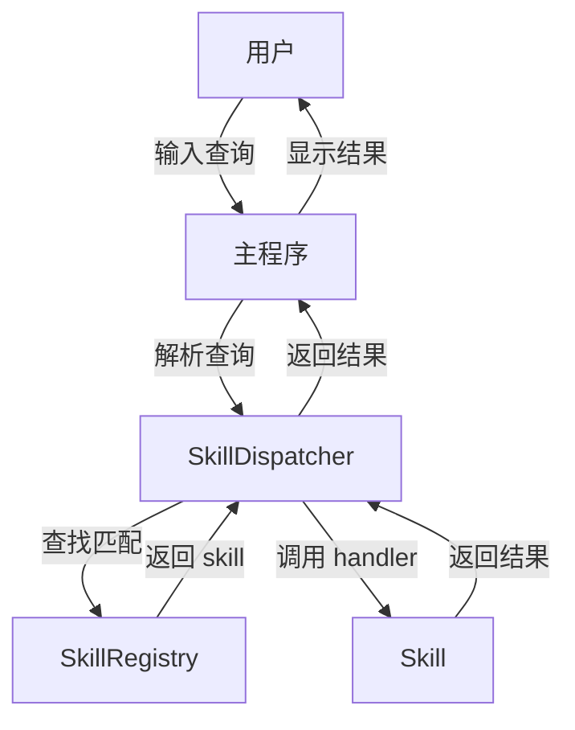

# 技术设计文档

## 概述

本设计文档描述 Python Skill Demo 程序的技术实现方案。该程序实现一个简单的 skill 调度系统，包含 skill 定义、注册、匹配和执行的完整流程。

系统采用模块化设计，主要包含以下核心组件：
- **Skill**: 功能单元的数据结构定义
- **SkillRegistry**: skill 的注册和管理
- **SkillDispatcher**: 用户查询的解析和 skill 匹配
- **主程序**: 命令行交互界面

## 架构

### 系统架构图



### 模块结构

```
python-skill-demo/
├── skill.py          # Skill 数据类定义
├── registry.py       # SkillRegistry 实现
├── dispatcher.py     # SkillDispatcher 实现
├── demo_skill.py     # Demo Skill 实现
└── main.py           # 主程序入口
```

## 组件和接口

### Skill 类

```python
@dataclass
class Skill:
    name: str                    # 唯一标识名称
    description: str             # 功能描述
    keywords: List[str]          # 匹配关键词列表
    handler: Callable[[], str]   # 处理函数，返回字符串结果
```

### SkillRegistry 类

```python
class SkillRegistry:
    def __init__(self) -> None:
        """初始化空的 skill 注册表"""
    
    def register(self, skill: Skill) -> None:
        """注册 skill，如果名称已存在则覆盖"""
    
    def get_all_skills(self) -> List[Skill]:
        """获取所有已注册的 skill 列表"""
    
    def find_by_name(self, name: str) -> Optional[Skill]:
        """根据名称查找 skill"""
```

### SkillDispatcher 类

```python
class SkillDispatcher:
    def __init__(self, registry: SkillRegistry) -> None:
        """初始化 dispatcher，关联 skill 注册表"""
    
    def dispatch(self, query: str) -> str:
        """
        解析用户查询并调用匹配的 skill
        
        Args:
            query: 用户输入的查询字符串
            
        Returns:
            skill 执行结果或 "未找到匹配的 skill" 提示
        """
```

### Demo Skill 工厂函数

```python
def create_greeting_skill() -> Skill:
    """创建 greeting demo skill"""
```

## 数据模型

### Skill 数据结构

| 字段 | 类型 | 描述 | 约束 |
|------|------|------|------|
| name | str | skill 唯一标识 | 非空字符串 |
| description | str | skill 功能描述 | 非空字符串 |
| keywords | List[str] | 匹配关键词 | 非空列表 |
| handler | Callable[[], str] | 处理函数 | 返回字符串 |

### SkillRegistry 内部存储

使用 `Dict[str, Skill]` 存储已注册的 skill，以 name 为键实现 O(1) 查找和覆盖。

### 关键词匹配逻辑

SkillDispatcher 采用简单的子字符串匹配：
1. 将用户查询转换为小写
2. 遍历所有已注册 skill 的 keywords
3. 检查任一 keyword 是否为查询的子字符串
4. 返回第一个匹配的 skill


## 正确性属性

*正确性属性是系统在所有有效执行中应保持为真的特征或行为——本质上是关于系统应该做什么的形式化陈述。属性作为人类可读规范和机器可验证正确性保证之间的桥梁。*

### Property 1: Skill 结构完整性

*For any* Skill 实例，该实例应包含所有必需字段：name（非空字符串）、description（非空字符串）、keywords（非空列表）和 handler（可调用对象）。

**Validates: Requirements 1.1, 1.2, 1.3, 1.4**

### Property 2: Skill handler 返回字符串

*For any* Skill 实例，调用其 handler 函数应返回字符串类型的结果。

**Validates: Requirements 1.5**

### Property 3: Skill 注册 round-trip

*For any* Skill 列表，将所有 skill 注册到 SkillRegistry 后，调用 get_all_skills() 应返回包含所有已注册 skill 的列表（按 name 去重后）。

**Validates: Requirements 2.2**

### Property 4: 重复注册覆盖

*For any* 两个具有相同 name 的 Skill，先后注册到 SkillRegistry 后，通过 name 查找应返回后注册的 Skill。

**Validates: Requirements 2.3**

### Property 5: 关键词匹配调用 skill

*For any* 已注册的 Skill 和包含该 skill 任一 keyword 的查询字符串，SkillDispatcher.dispatch() 应返回该 skill handler 的执行结果。

**Validates: Requirements 3.2, 3.4**

### Property 6: 无匹配返回提示

*For any* 不包含任何已注册 skill 关键词的查询字符串，SkillDispatcher.dispatch() 应返回 "未找到匹配的 skill"。

**Validates: Requirements 3.3**

## 错误处理

### 输入验证

| 场景 | 处理方式 |
|------|----------|
| 空查询字符串 | 返回 "未找到匹配的 skill" |
| 纯空白查询 | 返回 "未找到匹配的 skill" |
| handler 执行异常 | 捕获异常，返回错误提示信息 |

### 边界情况

- **空 Registry**: dispatcher 在空注册表上查询时返回未匹配提示
- **大小写处理**: 关键词匹配忽略大小写
- **多 skill 匹配**: 返回第一个匹配的 skill 结果

## 测试策略

### 测试方法

本项目采用双重测试策略：

1. **单元测试**: 验证具体示例、边界情况和错误条件
2. **属性测试**: 验证跨所有输入的通用属性

### 属性测试配置

- **测试库**: 使用 `hypothesis` 库进行属性测试
- **迭代次数**: 每个属性测试最少运行 100 次
- **标签格式**: `# Feature: python-skill-demo, Property {number}: {property_text}`

### 单元测试覆盖

| 测试目标 | 测试内容 |
|----------|----------|
| Demo Skill | 验证 name 为 "greeting"，keywords 包含指定关键词 |
| 主程序退出 | 验证 "exit" 和 "quit" 触发退出 |
| 欢迎信息 | 验证程序启动显示欢迎信息 |

### 属性测试覆盖

| Property | 测试描述 |
|----------|----------|
| Property 1 | 生成随机 Skill，验证结构完整性 |
| Property 2 | 生成随机 Skill，验证 handler 返回类型 |
| Property 3 | 生成随机 Skill 列表，验证注册 round-trip |
| Property 4 | 生成同名 Skill 对，验证覆盖行为 |
| Property 5 | 生成 Skill 和匹配查询，验证调用结果 |
| Property 6 | 生成不匹配查询，验证返回提示 |

### 测试文件结构

```
tests/
├── test_skill.py           # Skill 类测试
├── test_registry.py        # SkillRegistry 测试
├── test_dispatcher.py      # SkillDispatcher 测试
├── test_demo_skill.py      # Demo Skill 示例测试
└── conftest.py             # pytest fixtures 和 hypothesis 配置
```
