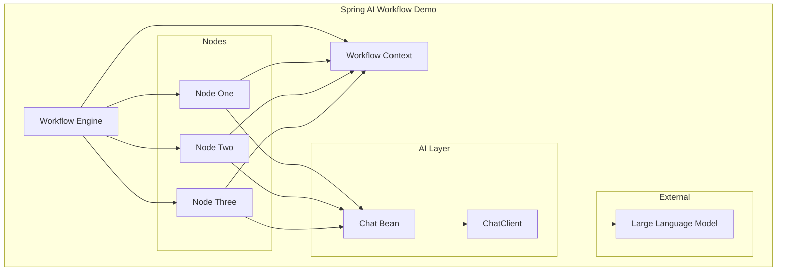
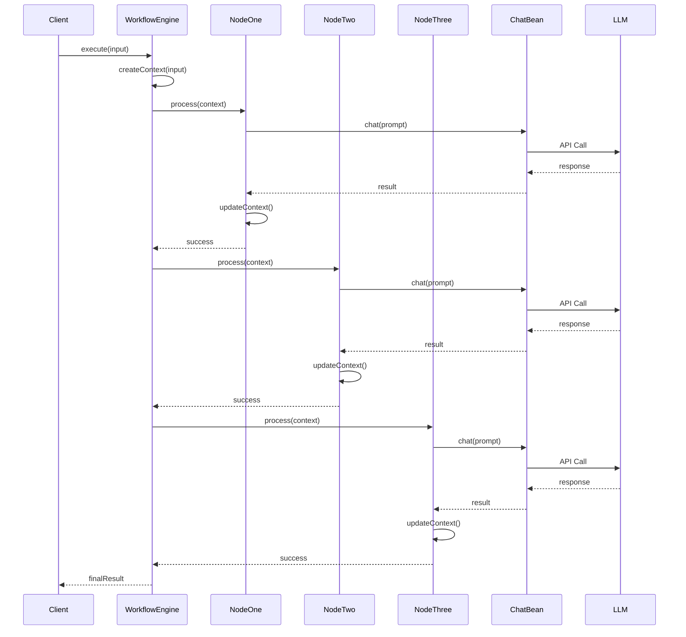

# Technical Design Document

## Overview

本设计文档描述了基于 Spring AI 2.0 框架的 Workflow Demo 程序的技术实现方案。该程序实现一个包含 3 个节点的顺序工作流，每个节点通过封装的 Chat Bean 访问大模型进行 AI 处理。

### 设计目标

- 构建可扩展的工作流架构
- 实现节点间的松耦合设计
- 提供可测试的组件结构
- 利用 Spring AI 2.0 的 ChatClient API

### 技术栈

- Java 21 (JDK 21)
- Spring Boot 3.x
- Spring AI 2.0
- JUnit 5 + Mockito
- Maven

## Architecture

### 系统架构图



### 执行流程



## Components and Interfaces

### 1. WorkflowNode 接口

所有工作流节点的基础接口：

```java
public interface WorkflowNode {
    /**
     * 处理工作流上下文
     * @param context 工作流上下文
     * @return 处理后的上下文
     * @throws WorkflowException 处理失败时抛出
     */
    WorkflowContext process(WorkflowContext context) throws WorkflowException;
    
    /**
     * 获取节点名称
     */
    String getName();
}
```

### 2. ChatService (Chat Bean)

封装 ChatClient 的服务类：

```java
@Service
public class ChatService {
    private final ChatClient chatClient;
    
    public ChatService(ChatClient.Builder chatClientBuilder) {
        this.chatClient = chatClientBuilder.build();
    }
    
    /**
     * 发送消息到大模型并获取响应
     * @param prompt 提示词
     * @return 模型响应
     */
    public String chat(String prompt) {
        return chatClient.prompt()
            .user(prompt)
            .call()
            .content();
    }
}
```

### 3. 节点实现

#### NodeOne - 初始处理节点

```java
@Component
public class NodeOne implements WorkflowNode {
    private final ChatService chatService;
    
    @Override
    public WorkflowContext process(WorkflowContext context) {
        String input = context.getInput();
        String prompt = buildPrompt(input);
        String result = chatService.chat(prompt);
        context.setNodeOneOutput(result);
        return context;
    }
}
```

#### NodeTwo - 中间处理节点

```java
@Component
public class NodeTwo implements WorkflowNode {
    private final ChatService chatService;
    
    @Override
    public WorkflowContext process(WorkflowContext context) {
        String input = context.getNodeOneOutput();
        String prompt = buildPrompt(input);
        String result = chatService.chat(prompt);
        context.setNodeTwoOutput(result);
        return context;
    }
}
```

#### NodeThree - 最终处理节点

```java
@Component
public class NodeThree implements WorkflowNode {
    private final ChatService chatService;
    
    @Override
    public WorkflowContext process(WorkflowContext context) {
        String input = context.getNodeTwoOutput();
        String prompt = buildPrompt(input);
        String result = chatService.chat(prompt);
        context.setFinalOutput(result);
        return context;
    }
}
```

### 4. WorkflowEngine

工作流引擎，协调节点执行：

```java
@Service
public class WorkflowEngine {
    private final List<WorkflowNode> nodes;
    private static final Logger log = LoggerFactory.getLogger(WorkflowEngine.class);
    
    public WorkflowEngine(NodeOne nodeOne, NodeTwo nodeTwo, NodeThree nodeThree) {
        this.nodes = List.of(nodeOne, nodeTwo, nodeThree);
    }
    
    /**
     * 执行工作流
     * @param input 初始输入
     * @return 最终结果
     * @throws WorkflowException 执行失败时抛出
     */
    public String execute(String input) throws WorkflowException {
        WorkflowContext context = new WorkflowContext(input);
        
        for (WorkflowNode node : nodes) {
            try {
                log.info("Executing node: {}", node.getName());
                context = node.process(context);
            } catch (Exception e) {
                log.error("Node {} failed: {}", node.getName(), e.getMessage());
                throw new WorkflowException("Workflow failed at node: " + node.getName(), e);
            }
        }
        
        return context.getFinalOutput();
    }
}
```

## Data Models

### WorkflowContext

工作流上下文，在节点间传递数据：

```java
public class WorkflowContext {
    private final String input;
    private String nodeOneOutput;
    private String nodeTwoOutput;
    private String finalOutput;
    private final Map<String, Object> metadata;
    private final Instant createdAt;
    
    public WorkflowContext(String input) {
        this.input = input;
        this.metadata = new HashMap<>();
        this.createdAt = Instant.now();
    }
    
    // Getters and Setters
    public String getInput() { return input; }
    
    public String getNodeOneOutput() { return nodeOneOutput; }
    public void setNodeOneOutput(String output) { this.nodeOneOutput = output; }
    
    public String getNodeTwoOutput() { return nodeTwoOutput; }
    public void setNodeTwoOutput(String output) { this.nodeTwoOutput = output; }
    
    public String getFinalOutput() { return finalOutput; }
    public void setFinalOutput(String output) { this.finalOutput = output; }
    
    public void putMetadata(String key, Object value) { metadata.put(key, value); }
    public Object getMetadata(String key) { return metadata.get(key); }
}
```

### WorkflowException

工作流异常类：

```java
public class WorkflowException extends RuntimeException {
    private final String nodeName;
    
    public WorkflowException(String message) {
        super(message);
        this.nodeName = null;
    }
    
    public WorkflowException(String message, Throwable cause) {
        super(message, cause);
        this.nodeName = extractNodeName(message);
    }
    
    public String getNodeName() { return nodeName; }
}
```

### 配置模型

```yaml
# application.yml
spring:
  ai:
    openai:
      api-key: ${OPENAI_API_KEY}
      base-url: ${OPENAI_BASE_URL:https://dashscope.aliyuncs.com/compatible-mode/v1}
      chat:
        options:
          model: qwen3.5-plus
          temperature: 0.7
```

